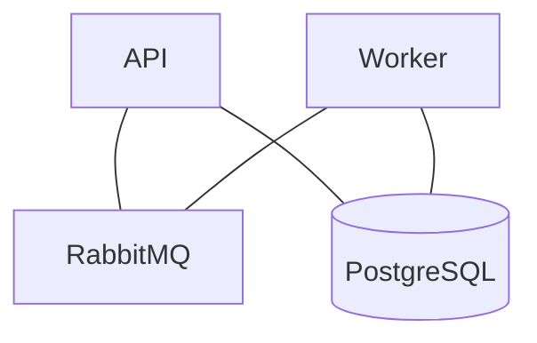
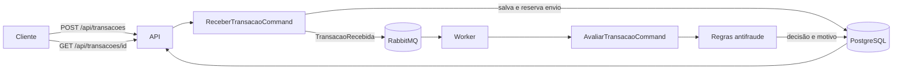

# Netrin Antifraude

API de avaliação antifraude para transações financeiras. Recebe a transação, envia para processamento no Worker e registra a decisão: aprovada, rejeitada ou em revisão manual. O resultado pode ser consultado pelo ID da transação.

## Como está organizado

| Projeto | Responsabilidade |
| --- | --- |
| `Netrin.Antifraude.Api` | Recebe e consulta transações por HTTP. Usa Basic Auth. |
| `Netrin.Antifraude.Application` | Contém os commands, as consultas LINQ, as regras de avaliação e a publicação de mensagens. |
| `Netrin.Antifraude.Core` | Biblioteca compartilhada com entidades, enums, DTOs e o contrato da mensagem. Não depende da API nem do Worker. |
| `Netrin.Antifraude.Infrastructure` | Persiste transações e avaliações no PostgreSQL com Entity Framework Core. |
| `Netrin.Antifraude.Worker` | Consome mensagens do RabbitMQ e executa a avaliação. |

API e Worker chamam os commands pelo MediatR. A comunicação entre eles usa MassTransit com RabbitMQ.

## Execução com Docker

Com o Docker em execução, rode na raiz do repositório:

```powershell
docker compose -f "API Docker Compose/docker-compose.yaml" up --build -d
```

Esse compose sobe PostgreSQL, RabbitMQ, migrador, Worker e API. O migrador aplica as migrations e encerra antes da inicialização do Worker e da API. A API também executa as migrations pendentes ao iniciar.

Caso ocorra algum erro relacionado às entidades, migrations ou atualização do banco, execute na raiz do repositório:

```powershell
dotnet ef database update
```

O projeto está orquestrado para que esse comando seja executado diretamente pela raiz da solução. O `DbContext` está localizado em `Netrin.Antifraude.Infrastructure` e as entidades estão em `Netrin.Antifraude.Application`.

O Swagger fica em [http://localhost:8080/swagger](http://localhost:8080/swagger) e o painel do RabbitMQ em [http://localhost:15672](http://localhost:15672).

As credenciais locais padrão são `antifraude` / `antifraude_local`.

No compose, essas configurações podem ser alteradas pelas variáveis:

```text
API_USER
API_PASSWORD
DB_PASSWORD
RABBITMQ_PASSWORD
```

As portas abaixo precisam estar livres:

```text
5432  - PostgreSQL
5672  - RabbitMQ
15672 - RabbitMQ Management
8080  - API
```

Os dados do PostgreSQL e do RabbitMQ ficam armazenados em volumes do Docker.

## Padrões utilizados

**Builder.** As regras chamam `RejeitarSe` ou `RevisarSe` no `AvaliacaoBuilder`. Ele acumula os motivos e monta o resultado em `Construir`, dando prioridade à rejeição. Uma nova validação pode ser acrescentada sem repetir a lógica que define a decisão final.

**Commands e MediatR.** O controller envia `ReceberTransacaoCommand` e o consumidor envia `AvaliarTransacaoCommand`. O MediatR encaminha cada chamada ao handler e devolve o resultado. Cada handler concentra as etapas do seu caso de uso.

**CQRS.** Nos fluxos de recebimento e avaliação, os commands gravam pelo repository e consultam pela `TransacaoQuery`. O repository cuida da persistência com EF Core; a query reúne as consultas LINQ. Leitura e escrita usam o mesmo banco.

**Retry.** Quando o consumo de uma mensagem falha, o MassTransit faz três novas tentativas, com intervalo fixo de cinco segundos. Se todas falharem, a mensagem vai para a fila de erro. Não há backoff progressivo nem reprocessamento automático dessa fila.

## Componentes do sistema



## Fluxo da transação



1. A API procura a chave de idempotência. Se for nova, grava a transação como pendente.
2. O command reserva o envio no banco e publica `TransacaoRecebida`, que contém o ID da transação.
3. O Worker recebe a mensagem, busca a transação e aplica as regras.
4. A decisão e o motivo são gravados no PostgreSQL. O cliente consulta o resultado pelo ID.

As regras rejeitam transações inativas, valores acima de R$ 50.000 e valores com fração de centavo. Valores a partir de R$ 10.000 ou abaixo de R$ 1 vão para revisão manual. Sem ocorrência dessas condições, a transação é aprovada. Rejeição tem prioridade sobre revisão.

Os enums de status e decisão são retornados como números. Os campos `statusDescricao` e `decisaoDescricao` trazem os nomes correspondentes, como `Processada` e `Rejeitada`.

## Endpoints

Os dois endpoints exigem Basic Auth. Na execução local, as credenciais estão em `appsettings.Development.json`. No Docker, o compose repassa `API_USER` e `API_PASSWORD` para `BasicAuth__Usuario` e `BasicAuth__Senha`.

### `POST /api/transacoes`

```json
{
  "idempotencyKey": "pedido-001",
  "valor": 15000
}
```

A chave de idempotência é obrigatória no corpo da requisição. A API retorna `202 Accepted` enquanto não houver avaliação, `200 OK` se a transação já estiver avaliada e `409 Conflict` se a mesma chave for usada com outro valor. A resposta contém o ID, o status e, quando pronta, a avaliação com decisão e motivo.

### `GET /api/transacoes/{id}`

Retorna `200 OK` com a transação, seu status e sua avaliação. Para um ID desconhecido, retorna `404 Not Found`. Enquanto o Worker não terminar, o campo `avaliacao` é `null`.

O contrato implementado difere do solicitado no escopo: usa `/api/transacoes`, recebe a chave no corpo e descreve as decisões como `Aprovada`, `Rejeitada` e `RevisaoManual`. As rotas `/transactions`, o header `Idempotency-Key` e os textos `APPROVED`, `REJECTED` e `REVIEW` não estão implementados.

## Idempotência e deduplicação

`IdempotencyKey` tem índice único no PostgreSQL. Uma repetição com a mesma chave e o mesmo valor usa a transação existente; com outro valor, a API responde `409`. Se duas requisições tentarem criar a mesma chave ao mesmo tempo, a restrição única resolve a disputa.

O campo `EnvioParaAvaliacaoSolicitado` impede que duas chamadas publiquem a mesma transação ao mesmo tempo. O command altera esse campo antes de publicar, usando o controle de concorrência do EF Core. Se o `Publish` retornar erro, o command libera o envio para que um novo POST com a mesma chave possa tentar novamente. No Worker, uma transação que já tem avaliação não é avaliada outra vez; o banco também tem índice único para a avaliação por transação.

Banco e RabbitMQ não participam da mesma transação. Se a API cair depois de reservar o envio e antes de publicar, o registro pode ficar pendente sem mensagem. Não há recuperação automática desse caso nem Outbox nesta versão.

## Decisões arquiteturais

### ADR 1 — RabbitMQ para avaliação assíncrona

A avaliação fica no Worker para que a API possa responder assim que receber e publicar a transação. O RabbitMQ atende ao processamento por fila e tem integração com o MassTransit, usado na publicação, no consumo e no retry.

### ADR 2 — PostgreSQL para transações e avaliações

O PostgreSQL mantém as relações entre transação, status e avaliação. Os índices únicos garantem uma transação por chave de idempotência e uma avaliação por transação, inclusive quando há chamadas concorrentes.

### ADR 3 — Idempotência por chave e estado de envio

A deduplicação usa a chave de idempotência e o estado de envio gravados no PostgreSQL. Requisições repetidas recuperam a transação existente; o controle de concorrência evita que duas chamadas reservem o mesmo envio. O Worker verifica a avaliação existente antes de processar novamente.

### ADR 4 — Builder para compor as regras antifraude

O `AvaliacaoBuilder` reúne os resultados de várias validações em uma avaliação. As regras informam a condição e o motivo; o Builder resolve a prioridade entre rejeição, revisão e aprovação. Isso mantém a composição das regras legível e concentra a decisão final em um único lugar.

### ADR 5 — Core como biblioteca compartilhada

O Core concentra entidades, enums, DTOs e contratos de mensagens usados pela API e pelo Worker. Não depende de HTTP, MassTransit ou EF Core e pode ser referenciado por outras aplicações .NET. Uma integração com front-end usa o JSON exposto pela API. Commands, consultas e regras de avaliação ficam na Application.
