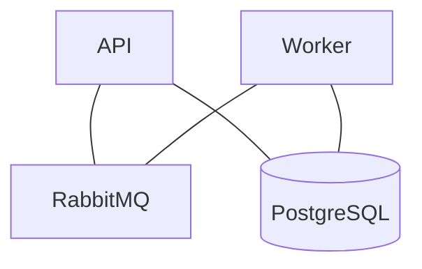
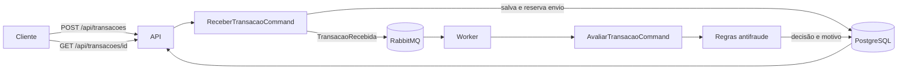

# Netrin Antifraude

Este projeto recebe transações financeiras, aplica regras de risco e grava uma decisão: aprovada, rejeitada ou enviada para revisão manual. A avaliação acontece em segundo plano. Por isso, o POST pode retornar antes de a decisão estar pronta.

## Como está organizado

| Projeto | Responsabilidade |
| --- | --- |
| `Netrin.Antifraude.Api` | Recebe e consulta transações por HTTP. Usa Basic Auth. |
| `Netrin.Antifraude.Application` | Contém as entidades, commands, as consultas, as regras de avaliação e a publicação da mensagem. |
|`Netrin.Antifraude.Core` | Biblioteca compartilhada com entidades, enums, DTOs e o contrato da mensagem. Não depende da API nem do Worker. |
| `Netrin.Antifraude.Infrastructure` | Persiste transações e avaliações no PostgreSQL com Entity Framework Core. |
| `Netrin.Antifraude.Worker` | Consome mensagens do RabbitMQ e executa a avaliação. |

API e Worker chamam os commands pelo MediatR. A comunicação entre eles usa MassTransit com RabbitMQ.

Além de `Código Fonte`, o repositório tem `Postgre Docker Compose` e `RabbitMQ Docker Compose` para subir cada dependência separadamente, e `API Docker Compose` para subir o sistema inteiro em contêineres.

## Resumo de Padrões utilizados
**Builder nas regras.** Cada condição chama `RejeitarSe` ou `RevisarSe` no `AvaliacaoBuilder`. Ele reúne os motivos e decide uma vez no final, com prioridade para rejeição. Assim, posso acrescentar uma regra sem espalhar `if` e decisões finais por vários pontos do código.

**Commands com MediatR.** A API envia `ReceberTransacaoCommand` e o Worker envia `AvaliarTransacaoCommand`. O MediatR chama o handler correspondente e devolve o resultado. Controllers e consumidores ficam pequenos, enquanto cada handler mostra o fluxo completo do seu caso de uso.

**CQRS simples.** Os commands cuidam das operações que mudam o estado. O repository executa inserções e alterações no banco e concentra detalhes do EF Core, como anexar a avaliação antes de salvar; `TransacaoQuery` fica com as leituras feitas por LINQ. 

**Retry no Worker.** Se o consumo da mensagem falhar, o MassTransit faz três novas tentativas com intervalo fixo de cinco segundos. Isso dá tempo para uma falha transitória passar. Esgotadas as tentativas, a mensagem vai para a fila de erro para análise; o retry não corrige uma falha definitiva da regra ou dos dados.

## Componentes do sistema



## Fluxo da transação



1. A API procura a chave de idempotência. Se for nova, grava a transação como pendente.
2. O command reserva o envio no banco e publica `TransacaoRecebida`, que contém o ID da transação.
3. O Worker recebe a mensagem, busca a transação e aplica as regras.
4. A decisão e o motivo são gravados no PostgreSQL. O cliente consulta o resultado pelo ID.

As regras rejeitam transações inativas, valores acima de R$ 50.000 e valores com fração de centavo. Valores a partir de R$ 10.000 ou abaixo de R$ 1 vão para revisão manual. Sem ocorrência dessas condições, a transação é aprovada. Rejeição tem prioridade sobre revisão.

No código, as decisões são `Aprovada`, `Rejeitada` e `RevisaoManual`. O contrato HTTP atual não usa os textos `APPROVED`, `REJECTED` e `REVIEW` pedidos no escopo original.

## API atual

Os dois endpoints exigem Basic Auth. As credenciais de desenvolvimento estão em `appsettings.Development.json`; Fora de desenvolvimento, estão concentradas em Variáveis de Ambiente: `BasicAuth__Usuario` e `BasicAuth__Senha`.

### `POST /api/transacoes`

```json
{
  "idempotencyKey": "pedido-001",
  "valor": 15000
}
```

A chave é obrigatória e hoje vai **no corpo**, não no header `Idempotency-Key`. A API retorna `202 Accepted` enquanto não houver avaliação, `200 OK` se a transação já estiver avaliada e `409 Conflict` se a mesma chave for usada com outro valor. A resposta contém o ID, o status e, quando pronta, a avaliação com decisão e motivo.

### `GET /api/transacoes/{id}`

Retorna `200 OK` com a transação, seu status e sua avaliação, quando existir. Retorna `404 Not Found` para um ID desconhecido. Enquanto o Worker não terminar, a avaliação fica vazia.

As rotas acima descrevem o sistema implementado. O contrato `/transactions` com chave no header ainda precisa ser feito se os nomes e o formato do escopo original forem obrigatórios.

## Idempotência e deduplicação

`IdempotencyKey` tem índice único no PostgreSQL. Uma repetição com a mesma chave e o mesmo valor usa a transação existente; com outro valor, a API responde `409`. Se duas requisições tentarem criar a mesma chave ao mesmo tempo, a restrição única resolve a disputa.

O campo `EnvioParaAvaliacaoSolicitado` impede que duas chamadas publiquem a mesma transação ao mesmo tempo. O command altera esse campo antes de publicar, usando o controle de concorrência do EF Core. Se o `Publish` retornar erro, o command libera o envio para que um novo POST com a mesma chave possa tentar novamente. No Worker, uma transação que já tem avaliação não é avaliada outra vez; o banco também tem índice único para a avaliação por transação.

Banco e RabbitMQ não participam da mesma transação. Se a API cair depois de reservar o envio e antes de publicar, o registro pode ficar pendente sem mensagem. Não há recuperação automática desse caso nem Outbox nesta versão.


## Decisões arquiteturais

### ADR 1 — RabbitMQ para avaliação assíncrona

A API envia a transação para uma fila no RabbitMQ e um Worker realiza a avaliação.

O RabbitMQ foi escolhido por atender bem esse fluxo e por já utilizarmos MassTransit no projeto. Kafka adicionaria uma complexidade desnecessária para esse cenário.


### ADR 2 — PostgreSQL para transações e avaliações

Usar banco relacional com índices únicos para chave de idempotência e avaliação por transação. As relações e a consistência dessas gravações são centrais para o módulo.


### ADR 3 — Idempotência por chave e estado de envio

Usar uma chave única no PostgreSQL, retornar a transação existente quando os dados forem iguais e rejeitar o uso da mesma chave com outro valor. Antes de publicar, o command reserva o envio; o Worker também verifica se já existe avaliação. 

### ADR 4 — Builder para compor as regras antifraude

Manter as regras no código e reuni-las com `AvaliacaoBuilder`. Cada validação informa se deve rejeitar ou enviar para revisão; o Builder resolve a decisão no final, dando prioridade à rejeição. **Consequência:** fica simples acrescentar ou explicar uma regra sem criar vários fluxos de decisão. Se as regras passarem a ser configuradas por usuários ou mudarem com muita frequência, essa estrutura precisará ser revista.


### ADR 5 — Core como biblioteca compartilhada

API e Worker usam os mesmos tipos, e outras integrações podem surgir. Decidi manter no Core os modelos e contratos comuns, sem dependência de HTTP, RabbitMQ ou banco; commands, consultas e validações ficam na Application. Isso permite reutilizar os contratos em outra API .NET. Para um front-end, o compartilhamento acontece pelo JSON exposto pela API.
